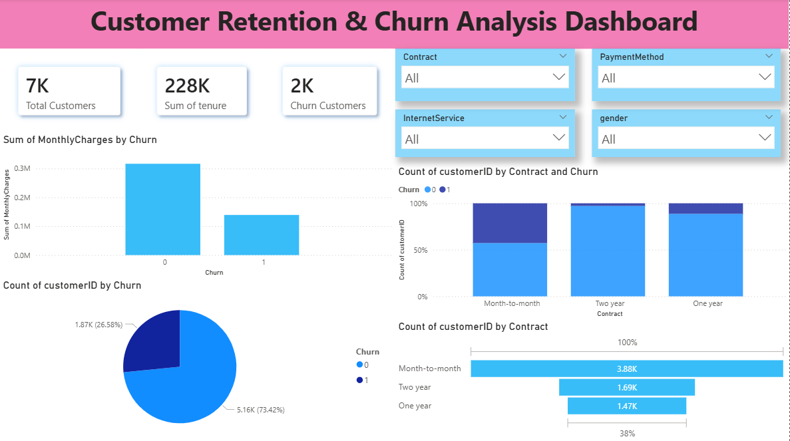

# Customer Retention & Churn Analysis Dashboard



---

# 📌 Project Overview

The **Customer Retention & Churn Analysis Dashboard** is an interactive business intelligence project built using **Power BI** to analyze customer retention patterns, churn behavior, and customer service insights.

This dashboard helps organizations understand:

* Why customers leave the service
* Which contract types have higher churn
* How payment methods and internet services affect churn
* Customer distribution and retention trends
* Revenue impact caused by customer churn

The project provides meaningful business insights that can help improve customer retention strategies and reduce customer loss.

---

# 🎯 Objectives

The main objectives of this project are:

* Analyze customer churn behavior
* Identify factors affecting customer retention
* Track customer distribution across contract types
* Measure monthly charges and tenure trends
* Build an interactive dashboard for business decision-making
* Provide recommendations to reduce churn rate

---

# 🛠️ Tools & Technologies Used

| Tool / Technology     | Purpose                                   |
| --------------------- | ----------------------------------------- |
| Power BI              | Data visualization and dashboard creation |
| Microsoft Excel / CSV | Dataset handling                          |
| DAX                   | Measures and calculations                 |
| Power Query           | Data cleaning and transformation          |
| Data Analytics        | Customer churn analysis                   |

---

# 📂 Dataset Information

The dataset contains customer information such as:

* Customer ID
* Gender
* Contract Type
* Payment Method
* Internet Service
* Monthly Charges
* Tenure
* Churn Status

### Key Features in Dataset

| Feature         | Description                      |
| --------------- | -------------------------------- |
| tenure          | Number of months customer stayed |
| MonthlyCharges  | Monthly billing amount           |
| Contract        | Subscription contract type       |
| PaymentMethod   | Customer payment mode            |
| InternetService | Internet service provider type   |
| Churn           | Whether customer left or stayed  |

---

# 📊 Dashboard Features

The dashboard includes:

### KPI Cards

* Total Customers
* Sum of Tenure
* Churn Customers

### Visualizations

* Monthly Charges by Churn
* Customer Distribution by Churn
* Contract-wise Churn Analysis
* Contract Distribution Funnel Chart
* Interactive Filters/Slicers

### Interactive Filters

Users can filter dashboard data using:

* Contract Type
* Payment Method
* Internet Service
* Gender

---

# 📈 Key Insights

## 1. Customer Churn Overview

* Total customers analyzed: **7K**
* Total churn customers: **2K**
* Churn percentage is significantly high and requires business attention.

## 2. Contract Type Analysis

* Customers with **Month-to-Month contracts** show the highest churn rate.
* Customers with **One-Year** and **Two-Year contracts** have better retention.

## 3. Monthly Charges Impact

* Customers with higher monthly charges tend to churn more frequently.
* Pricing and service value perception may influence customer decisions.

## 4. Customer Retention Pattern

* Long-term contract customers are more loyal.
* Short-term plans increase the probability of customer loss.

## 5. Tenure Analysis

* Customers with low tenure are more likely to churn.
* Early customer engagement is critical for retention.

---

# 💡 Recommendations

## Business Recommendations

### 1. Encourage Long-Term Contracts

Offer:

* Annual subscription discounts
* Loyalty rewards
* Bundled service offers

This can reduce churn among month-to-month customers.

### 2. Improve Customer Onboarding

Customers with lower tenure churn more often. Companies should:

* Improve onboarding experience
* Provide personalized support
* Offer tutorials and assistance during initial months

### 3. Reduce High-Charge Customer Churn

Businesses should:

* Provide flexible pricing plans
* Introduce value-added services
* Offer promotional discounts for high-paying customers

### 4. Build Customer Loyalty Programs

Reward long-term customers through:

* Cashback offers
* Premium support
* Exclusive membership benefits

### 5. Use Predictive Analytics

Organizations can implement machine learning models to:

* Predict churn probability
* Identify high-risk customers
* Take preventive actions proactively

---

# 📷 Dashboard Preview

## Main Dashboard


---

# 📌 Project Workflow

1. Data Collection
2. Data Cleaning
3. Data Transformation using Power Query
4. Data Modeling
5. DAX Calculations
6. Dashboard Design
7. Insight Generation
8. Business Recommendations

---

# 📊 DAX Measures Used

Some important DAX measures used in this project:

```DAX
Total Customers = COUNT(Customer[customerID])

Churn Customers = CALCULATE(
    COUNT(Customer[customerID]),
    Customer[Churn] = "Yes"
)

Total Tenure = SUM(Customer[tenure])
```

---

# 📈 Business Impact

This dashboard helps businesses:

* Improve customer retention
* Reduce revenue loss due to churn
* Understand customer behavior
* Improve customer satisfaction
* Support strategic business decisions

---

# 🚀 Future Improvements

Future enhancements for this project may include:

* Machine Learning churn prediction model
* Real-time data integration
* Customer segmentation analysis
* Sentiment analysis from customer feedback
* Advanced forecasting dashboards

---

# 📁 Project Structure

```bash
Customer-Retention-Churn-Analysis/
│
├── Dashboard_Main01.png
├── CustomerChurn.pbix
├── Dataset/
│   └── customer_churn.csv
├── README.md
└── Report.pdf
```

---

# ▶️ How to Use

1. Download the `.pbix` Power BI file.
2. Open the project in Power BI Desktop.
3. Refresh the dataset if needed.
4. Explore the dashboard using slicers and filters.
5. Analyze customer retention and churn trends.

---

# 🧠 Skills Demonstrated

This project demonstrates:

* Data Cleaning
* Data Visualization
* Business Intelligence
* Dashboard Design
* Customer Analytics
* Power BI Development
* DAX Calculations
* Data Storytelling

---

# 📌 Conclusion

The **Customer Retention & Churn Analysis Dashboard** provides actionable insights into customer behavior and churn trends. The project helps businesses identify high-risk customers, understand retention patterns, and create effective customer engagement strategies.

Through interactive visualizations and KPI monitoring, decision-makers can improve customer satisfaction and reduce churn effectively.

---

# 👨‍💻 Author

## Jatin Jajam

Aspiring Data Analyst | Power BI Developer | Business Intelligence Enthusiast

---

---

# 📜 License

This project is for educational and portfolio purposes.
